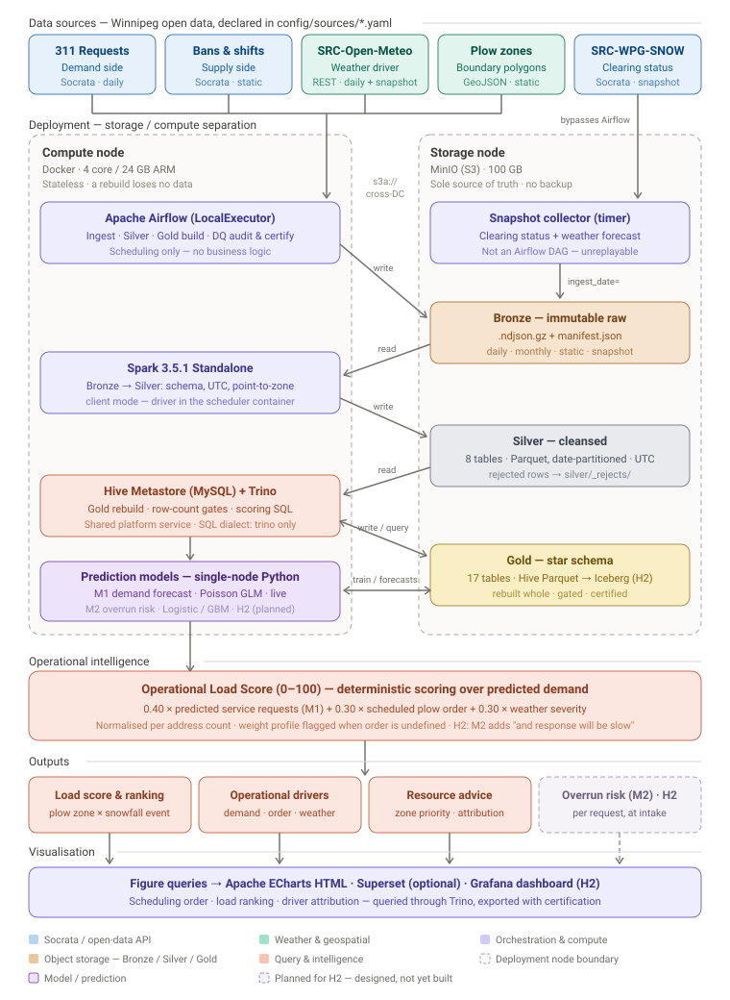

# Urban Operations Intelligence Platform (UOIP)

A self-hosted Lakehouse pipeline that ingests **City of Winnipeg** open data — 311
service requests, plow shifts and parking bans, weather, zone boundaries — and turns it
into a **Winter Operational Load Score** per zone, driven by a demand forecast and
surfaced as ranked resource recommendations.

> **The question it answers.** Winnipeg calls itself *Winterpeg*, and snow clearing is a
> standing item at City Council — CBC put the 2023 budget overrun at CAD 4.2 million.
> After each snowfall the operations desk needs to know which zones carried the highest
> service load, **why** (heavy snow? uncovered shift? slow response?), and what to change
> before the next storm. Demand, supply and weather data all exist, but they sit behind
> three endpoints and three non-nesting geographies. Nothing joins them. This does.

The City already ships a "has my street been cleared?" app and a live progress map, and
this project deliberately does not compete with them. It does what they do not:
**retrospective, cross-source, accountable operational analysis** — and, on top of it, a
forecast of where the next snowfall will land the heaviest service load.

## Architecture

```
Winnipeg Open Data (Socrata) + Open-Meteo
         ↓
Ingestion — Airflow DAGs (replayable sources) · storage-node timer (daily snapshots)
         ↓
Bronze (.ndjson.gz)  →  Silver (Parquet)  →  Gold (star schema)
                                                  ↓
                                   Prediction layer — demand forecast · overrun risk
                                                  ↓
                                        Operational Load Score engine
                                                  ↓
                                        Rankings · drivers · recommendations
```



Fully self-hosted, no managed cloud components: **MinIO · Spark 3.5.1 Standalone ·
Airflow · Hive Metastore · Trino · Superset**, all in Docker, with storage and compute on
two separate nodes. The reasoning behind each choice is in
[Architecture §7](docs/guide/architecture.md).

## Status

| Layer | State |
|---|---|
| **Bronze** — raw NDJSON in object storage | ✅ Ingestion machinery complete: clients, loaders, backfill, daily self-healing audit |
| **Snapshot collection** — the longitudinal clearing archive | 🟡 Code complete; deployment on the storage node is the open blocker |
| **Silver** — cleaned Parquet | 🟡 Weather and static-geography jobs run; the Winnipeg sources are next |
| **Gold** — Trino star schema | ❌ Not started |
| **Intelligence, recommendations, dashboard** | ❌ Not started |

Authoritative, always-current status lives in the **Implementation status** section of
`CLAUDE.md`.

## Quick start

```bash
make install
```

```bash
make lint && make test-unit
```

```bash
make stack-up
```

Full setup, configuration and troubleshooting:
[Getting Started](docs/guide/getting-started.md).

## Documentation

Start with **[Overview](docs/guide/overview.md)** — the problem, the eight business
objectives, and what the platform deliberately does not do.

| Guide | What it covers |
|---|---|
| [Overview](docs/guide/overview.md) | The business problem, objectives and outputs, non-goals, data constraints |
| [Architecture](docs/guide/architecture.md) | Layers, components, two-node topology, why this stack |
| [Data Sources](docs/guide/data-sources.md) | The datasets, measured sizes, known defects, adding a source |
| [Ingestion & Bronze](docs/guide/ingestion-bronze.md) | Partition strategies, manifests, scheduled DAGs, self-healing |
| [Silver ETL](docs/guide/silver-etl.md) | Spark job contract, Winnipeg-specific cleansing, adding a source |
| [Backfill](docs/guide/backfill.md) | Loading historical windows from CLI or Airflow |
| [Snapshot Collection](docs/guide/snapshot-collection.md) | The unreplayable daily collection: deploy, alert, troubleshoot |
| [Getting Started](docs/guide/getting-started.md) | Install, configure, run the stack, quality gates |
| [Operations](docs/guide/operations.md) | Runbook: schedules, failures, recovery, resource limits |

Developer documentation — requirements, design intent, and architecture decision records —
lives under [docs/dev/](docs/dev/README.md) and is written in Chinese.

## Repository layout

```
ingestion/      API clients, per-source fetchers, object-storage loaders, snapshot collector
spark/          PySpark jobs, reusable transforms, Silver schemas
sql/            DDL, incremental DML, intelligence SQL (Trino dialect; not yet created)
dags/           Airflow DAGs — scheduling only, no business logic
scripts/        Backfill CLI entry points and the snapshot collection CLI
config/         Source registry (YAML, Pydantic-validated)
contracts/      Data contracts
infra/docker/   Compute-node Docker stack (Airflow + Spark)
tests/          Unit tests, integration tests and fixture data
docs/           guide/ (English, outward-facing) and dev/ (Chinese, developer)
```

## Conventions

- **ETL jobs are idempotent** — re-running an execution date produces identical output
- **DAGs contain scheduling only** — business logic lives in `ingestion/` or `spark/`
- **All timestamps are UTC**
- **Bronze is immutable** — never overwrite a raw file
- **One SQL dialect** — Trino, pinned in `.sqlfluff`
- **No `SELECT *` in Gold SQL** — explicit column lists only
