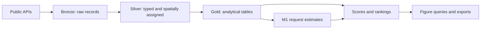

# Urban Operations Intelligence Platform

**UOIP** is an open-source data engineering project exploring winter operations
in Winnipeg, Canada. It connects service requests, residential plow schedules,
weather and geographic boundaries to study demand and scheduled service order
at the level of a snowfall event and a work zone.

The project includes a working data pipeline, historical findings, a request-count
model, and an auditable scoring and ranking experiment. Its value is in making
the path from public records to a result visible: inputs, transformations,
assumptions and checks can all be inspected.

**[Explore the project](docs/guide/overview.md)** ·
**[Read the findings](docs/guide/results.md)** ·
**[Try it locally](docs/guide/getting-started.md)**

## What it shows

Across 19 recorded residential plow operations, average scheduled position differs
by about 2.21 shifts between the earliest and latest zones, equivalent to roughly
26.5 hours of planned start offset. The order also changes over time. These are
schedule observations, not measured clearing-completion times or a fairness verdict.

The modeling layer estimates request counts from historical event features, then
SQL combines demand, scheduled order and weather into load scores. Missing
scheduling evidence is explicit: 924 of the 1,298 scoring rows use a partial
profile and are excluded from the recommendation table.

The historical holdout has only seven events. M1's error comparison and ranking
changes do not establish reliable predictive superiority or improved operations.
[Results](docs/guide/results.md) presents the measurements, controls and query
links together.

## How it works



Python handles ingestion; Spark handles Silver transformations; Trino queries
Parquet through Hive Metastore and builds Gold. Airflow schedules replayable
work. A separate collector preserves daily clearing-status observations, while
independent audits check data and cross-layer consistency.

All components can be self-hosted. The reference deployment separates storage
and compute; a learning setup can run standard components on one computer.
[Architecture](docs/guide/architecture.md) explains the responsibilities and the
lessons behind the design.

## Try a figure without a cluster

With Python 3.11+ and a full checkout, run from the repository root:

```bash
python3 -m scripts.presentation.render_html \
  tests/fixtures/presentation/FIG-BO2-01.json \
  --out var/guide-demo
```

Open `var/guide-demo/FIG-BO2-01.html` in a browser. The HTML embeds its data and
chart library, so no database or internet connection is needed to view it.
The fixture is explicitly **sample data**, not a published analytical result.

[Getting Started](docs/guide/getting-started.md) includes cloning the repository,
two more sample charts, a small real API pull, and instructions for connecting
your own MinIO, Spark, Hive Metastore and Trino services.

## Scope of this baseline

The guide describes the H1 historical-analysis delivery: the August 22, 2026
schema checkpoint, August 30–31 findings, and September 3 renderer baseline.
It includes 8 Silver table definitions, 17 populated Gold tables in the recorded
build, build gates, independent audits and 19 validated figure queries.

Three scheduling figures have an HTML renderer in the repository. Other figure
queries can be inspected or exported, but not all have a renderer here. The
operations dashboard and a pre-storm forecast evaluation are outside this
baseline. See [Overview](docs/guide/overview.md#what-this-version-delivers) for
the complete scope and [Results](docs/guide/results.md#data-and-version-context)
for dated evidence.

## Documentation

| Start here | What you will learn |
|---|---|
| [Overview](docs/guide/overview.md) | The problem, approach and delivery scope |
| [Getting Started](docs/guide/getting-started.md) | A local example, source pull and self-deployment path |
| [Results](docs/guide/results.md) | Findings, limitations and executable evidence |
| [Architecture](docs/guide/architecture.md) | The pipeline, technical choices and lessons learned |
| [Data Sources](docs/guide/data-sources.md) | What the inputs measure and which records enter the analysis |
| [Scoring and Recommendations](docs/guide/scoring-and-recommendations.md) | Model, factors, profiles and ranking interpretation |
| [Data Quality](docs/guide/data-quality.md) | Checks, reconciliation and certification |
| [Ingestion and Bronze](docs/guide/ingestion-bronze.md) | Collection, manifests and rerun semantics |
| [Silver ETL](docs/guide/silver-etl.md) | Typed records, spatial assignment and event rebuilding |
| [Backfill](docs/guide/backfill.md) | Historical windows and recovery |
| [Snapshot Collection](docs/guide/snapshot-collection.md) | Running the forward archive independently |
| [Operations](docs/guide/operations.md) | Refreshing results, diagnosing failures and maintaining services |

## License

Code is licensed under the [Apache License, Version 2.0](LICENSE). Redistribution
requirements are in [NOTICE](NOTICE). Source datasets retain their publishers'
terms; the code license does not relicense the data.
