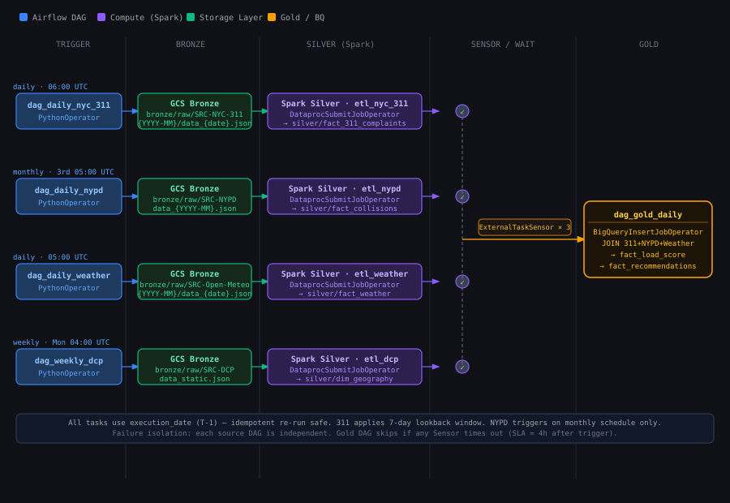

# ADR 0003 — Bronze 增量管道设计

> **Status**: Accepted · **Date**: 2026-06

决策：增量 DAG 与回填 DAG 复用同一套 `bulk.py` 函数，区别只在"窗口从哪来"——
回填从 Params 拿，增量从 `data_interval_start` 推算。一致性靠
`retries` + `catchup` + 每日 audit 自愈三层兜底。

---

### 已实现：增量数据入Bronze Layer
**目标**：新建 4 个增量 DAG，每天定时自动拉取最新数据落入 Bronze。

```
新增文件
├── dags/dag_ingest_nyc_311.py        每日 06:00，拉昨天的 311 数据
├── dags/dag_ingest_nypd.py           每月 1 日 06:00，拉上个月的 NYPD 数据
├── dags/dag_ingest_open_meteo.py     每日 06:00，拉昨天 + 未来 7 天天气
├── dags/dag_ingest_dcp.py            每月 1 日 06:00，刷新静态边界数据
└── dags/_dag_common.py               新增 get_yesterday() / get_last_month() 两个工具函数
```

###  backfill DAG 的本质区别


| -     | backfill DAG     | ingest DAG（增量）           |
| ----- | ---------------- |--------------------------|
| 触发方式  | 手动，Params 传日期    | 定时自动                     |
| 日期来源  | UI 输入的 start/end | `data_interval_start` 推算 |
| 复用的代码 | `bulk.py` 函数     | 完全相同的 `bulk.py` 函数       |
| 幂等性   | ✅                | ✅（重跑同一 Run 结果一样）         |

|文件|作用|
|---|---|
|`dags/_dag_common.py`|新增 `get_yesterday()` / `get_last_month()` 两个工具函数|
|`dags/dag_ingest_nyc_311.py`|每天 06:00，拉昨天 + 7 天 lookback 的 311 数据|
|`dags/dag_ingest_nypd.py`|每月 1 日 06:00，拉上月 NYPD 数据|
|`dags/dag_ingest_open_meteo.py`|每天 06:00，拉昨天确认数据 + 未来 7 天预报|
|`dags/dag_ingest_dcp.py`|每月 1 日 06:00，刷新静态边界数据|

#### 数据一致性保障

|优先级|措施|工作量|
|---|---|---|
|**立刻做**|`catchup=True` + `max_active_runs=1`|改 2 行|
|**立刻做**|加 `sla` 参数，失败发日志告警|改 4 行|
|**本周做**|写一个 `dag_audit_bronze.py`，每天扫 manifest 发现缺口自动补跑|新建 1 个 DAG|
|**后续做**|接 Slack / Email 真实告警|配置问题|

```text
ingest DAG 失败
    ↓
retries=3 自动重试（覆盖网络抖动）
    ↓ 仍失败
catchup=True 下次 scheduler 启动自动补跑
    ↓ 仍有缺口
dag_audit_bronze 每天 08:00 扫描 manifest
    发现缺口 → 直接调 bulk.py 补填
    补填失败 → task 标红 + 日志告警

```
---

### 如何做增量Pipeline

纵切


```text
Airflow Scheduler
    ↓ 发指令
Airflow Worker（轻量）
    ├─ BronzeTask → 直接在 Worker 上跑（Python HTTP 调用，很轻）
    ├─ SilverTask → 提交 job 给 Dataproc，然后等结果
    └─ GoldTask   → 提交 SQL 给 BigQuery，然后等结果
         ↑                    ↑
      Dataproc             BigQuery
   （真正跑 Spark）      （真正跑 SQL）
```

### 各层真实执行者（Phase 1 GCP）

|层|任务类型|真实执行者|Airflow Operator|
|---|---|---|---|
|Bronze|Python HTTP 调用 API|**Airflow Worker VM**|`PythonOperator`|
|Silver|PySpark 清洗转换|**Dataproc 集群**|`DataprocSubmitJobOperator`|
|Gold|BigQuery SQL|**BigQuery 无服务器**|`BigQueryInsertJobOperator`|

---