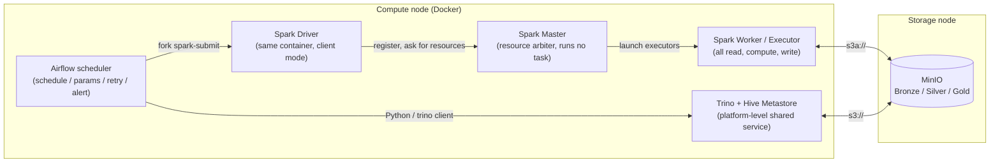

# ADR 0005 — 执行架构：每类工作跑在哪个组件里，边界在哪

> **Status**: Accepted · **Date**: 2026-06-29 · **Revised**: 2026-08-20
>
> 决策没变：**计算引擎用自建 Docker Spark Standalone，不用托管集群**，
> Airflow 只调度不碰数据。原文按 GCS 存储 + `SRC-Open-Meteo`/`SRC-DCP` 两个
> NYC 期数据集描述落地方式，二者均已作废——存储已于 2026-07-30 迁至 MinIO
> 且 GCP 整体放弃（[ADR 0006](0006-storage-compute-query-stack.md)），
> NYC 实例已退役（CLAUDE.md「城市无关护栏」§3）。这次重写换的是落地形态，
> 并把范围从「Bronze → Silver 一条链路」扩到**全栈的职责边界**——因为
> Trino / Gold 链路在原文之后才出现，而「什么进 Spark、什么不进」正是它带来的
> 新问题。方法与结论不变，故不另开 ADR。

## 与 ADR 0006 的分工（不要混读）

两篇容易重复，边界是这样切的，越界的内容各自往对方那里放：

| | 本篇 0005 | [ADR 0006](0006-storage-compute-query-stack.md) |
|---|---|---|
| 回答的问题 | **一件工作跑在哪个组件、哪个容器里，为什么** | **选哪些组件，部署在哪个节点** |
| 典型内容 | Driver 在 Airflow 容器里跑；Gold 不进 Spark；快照不进 Airflow 的**执行含义** | Trino vs DuckDB 选型；MinIO 取代 GCS；存算分离；`.ndjson.gz` |
| 变更触发 | 新增一类工作负载（如加一个引擎、加一层） | 换掉某个组件 |

---

## 1. 决策

1. **计算引擎是自建 Spark Standalone（Docker），提交方式是 `deploy-mode=client`。**
2. **Airflow 只做调度**：定时、渲染参数、重试、告警。它不读一行数据，不知道
   schema 是什么。
3. **进 Spark 的只有 Silver 层**——即「读 Bronze 半结构化文件 → 清洗 → 写
   Parquet」这一类工作。
4. **Gold 层不进 Spark，跑在 Trino**。Bronze 摄取也不进 Spark，跑纯 Python。
   判据见 §3。
5. **不可重放的采集（BO-7 快照）不进 Airflow**，跑在存储节点上（ADR 0006 §2.2
   的部署决策，本篇只记它的执行含义：它不受 Airflow 重试/告警覆盖，自带通知）。

---

## 2. 角色与容器



| 组件 | 跑在哪 | 一句话职责 | **不**负责什么 |
|---|---|---|---|
| **Airflow** | `airflow-scheduler` 等容器（计算节点） | 定时触发、渲染参数、重试、失败告警 | 不读写任何数据，不知道 schema |
| **Spark Driver** | 与 Airflow **同一个容器**（client 模式） | 把 job 的 Python DataFrame 代码编译成执行计划，向 Master 要资源 | 不处理数据 |
| **Spark Master** | `spark-master` | 决定哪个 Worker 接活 | 自己不执行 task |
| **Spark Worker / Executor** | `spark-worker` | 真正读 Bronze、转换、写 Silver | 不知道这个 job 是天气还是服务请求 |
| **Trino + Hive Metastore** | 计算节点上的**平台级共享服务**，不在本仓库的 compose 栈里（ADR 0006 §9） | Gold 建表与整表重建、Silver 的即席查询、Superset 的查询后端 | 不做 Bronze → Silver 的半结构化清洗 |
| **MinIO** | 存储节点 | Bronze/Silver/Gold 的唯一真相源 | 不参与任何计算 |

**最反直觉的一点**：Spark **Driver 不在 `spark-master` 容器里**，而在
`airflow-scheduler` 容器里。`SparkSubmitOperator` 就是在 Airflow 进程里 fork
一个 `spark-submit` 子进程，这个子进程本身即 Driver，只是向 `spark-master:7077`
申请资源。真正离开 Airflow 容器的只有 Executor，也只有 Executor 碰数据。

这条边界有两个实际后果，都在 [dags/_spark_common.py](../../../dags/_spark_common.py)
的注释里：Driver 与 Executor 是**两个镜像里的两个 Python**，所以
`spark.pyspark.python`（Executor，`/usr/local/bin/python3.11`）与
`spark.pyspark.driver.python`（Driver，`python3`）必须分别设；UDF 按限定模块名
cloudpickle，所以 Executor 需要 `spark.executorEnv.PYTHONPATH=/opt/airflow/plugins`
配合 compose 里对 `spark/` 的挂载。这三条与存储无关，**迁到 MinIO 后原样保留**。

### 2.1 全项目唯一的 Python UDF：几何体存 WKT

边界数据（`SRC-WPG-PLOW-ZONE`）的 `the_geom` 是 MultiPolygon，单行 GeoJSON
可达几百 KB。Silver 落库形态是 **WKT 字符串**（`geometry_wkt`），由
`spark/transforms/geography_boundary.py` 的 Shapely UDF 从 GeoJSON 转出，
下游 Trino 用 `ST_GeomFromText` 还原。

选 WKT 而非直接存 GeoJSON 的理由是**写入时就做几何校验**：非法/自相交的多边形
在 Silver 层就抛进 `_rejects/`，而不是等下游查询时才失败（实测 25 个作业分区里
有 8 个含 OGC 非法几何，靠 `make_valid` 修复且会报出来，不静默）。WKT 也更紧凑。

代价就是 §2 末尾那三条 conf：这是全项目唯一的 Python UDF，Executor 必须能
`import` 项目的 `spark/` 包。当年这是被迫的妥协（下游是 BigQuery），迁到 Trino
之后 WKT 反而是最直接的输入格式，故决策原样保留。

---

## 3. 什么进 Spark，什么不进

判据一句话：**Spark 的价值是「分布式地把半结构化文件解析成列式表」。
数据已经在表里之后，再进 Spark 就只剩开销。**

| 工作 | 引擎 | 入口 | 为什么 |
|---|---|---|---|
| Bronze 摄取（API → `.ndjson.gz`） | **纯 Python**（Airflow `PythonOperator` / CLI） | `ingestion/`、`scripts/backfill/` | 瓶颈是上游 API 的分页速率，不是本地 CPU；一次一个 HTTP 响应，没有可并行的数据集 |
| Bronze 审计与内容校验 | **纯 Python + boto3** | `dag_audit_bronze`、`scripts/profiling/` | 读的是 manifest 与逐分片抽样，量级是 KB |
| BO-7 快照采集 | **纯 Python，流式** | 存储节点上的定时任务，**不经 Airflow** | 全量物化会 OOM；且漏一天永久缺失，不能依赖可重建节点（ADR 0006 §2.2） |
| **Bronze → Silver** | **Spark** | `spark/jobs/etl_*.py`，`SparkSubmitOperator` | 唯一需要它的一类：1,200 万行 NDJSON 解析 + 显式 schema + 空间 UDF + 按日分区写 Parquet |
| Silver → **Gold** | **Trino** | `scripts/gold/build_gold.py`，`dag_gold_build` 的 `PythonOperator` | 输入已是 Parquet 表，工作是 SQL 聚合与 JOIN；再起一个 Spark 应用只为跑 SQL 是白付启动与调度成本，而 Trino 已常驻 |
| 元数据同步 | **Trino** | `dags/_trino_common.sync_partition_metadata` | Spark 写出的新日分区，Metastore 不会自己发现 |
| 探针 / 指标可行性 | **纯 Python** | `scripts/analysis/` | 只读公开 API，刻意不依赖 MinIO 与 Silver，才能作为管道的独立对照 |

两条推论值得单独写下来：

- **Gold 由 Airflow 的 `PythonOperator` 调 Trino，不是 `TrinoOperator`。**
  整表重建是「`DROP` → 清 storage prefix → `CREATE` → `INSERT` → 跑门禁」的
  多步序列（`.claude/rules/gold-sql.md` R4），其中清 prefix 是对象存储操作不是
  SQL。把依赖顺序、种子加载与行数门禁放在一个 Python 入口里，CLI 与 DAG 共用
  同一份实现。
- **Spark 与 Trino 通过 Hive Metastore 交接，不互相调用。** Spark 写文件 +
  分区目录，Trino 读同一份表；两侧的唯一契约是 `sql/ddl/` 与 Metastore。

---

## 4. 一次 Silver job 的执行链路

1. **Airflow 触发并渲染参数**，在 `airflow-scheduler` 容器里 fork：
   ```bash
   spark-submit --master spark://spark-master:7077 --deploy-mode client \
       --jars <hadoop-aws:3.3.4>,<aws-java-sdk-bundle:1.12.262> \
       --conf spark.hadoop.fs.s3a.endpoint=... \
       /opt/airflow/plugins/spark/jobs/etl_service_request.py \
       --bucket <bucket> --start <date> --end <date>
   ```
   凭据**不经 `--conf`**——它会出现在 Spark UI 环境页、进程列表和任务日志里；
   走 `spark-worker` 的环境变量注入。
2. **Driver 向 Master 注册**：靠 `bigdata-net` 里的容器名解析走 TCP 7077，
   不需要 SSH、不暴露宿主机端口。
3. **Master 在 Worker 上拉起 Executor**，`--jars` 在这一步分发。
4. **Executor 并行读 Bronze**：`spark.read.schema(...).json("s3a://...")`，
   永远显式传 schema。
5. **内存中清洗**：`spark/transforms/` 里的算子；能用 DataFrame 算子就不用
   Python UDF（UDF 才需要 §2 那三条 conf）。
6. **写 Silver**：按日分区 + `partitionOverwriteMode=dynamic`，
   只覆盖窗口涉及的分区，保证同一窗口重跑幂等（C6 的 Silver 侧形态）。
7. **同步分区元数据 + 审计**：`sync_partition_metadata` 让 Trino 看见新分区；
   行数低于基线则 `raise`，Airflow 标红，走 `DEFAULT_ARGS` 里的重试与告警。

**一个 DAG Run = 一个时间窗口。** Airflow 不切片：Bronze 由 `bulk.py` 切，
Silver 由 job 自己的 `[start, end)` 切。日常增量是固定回溯窗口，历史回填是同一个
job 手动传宽窗口——两者是同一份代码的两种窗口大小，`catchup=True` 不等于全量回填。

---

## 5. 被否决的方案

| 方案 | 否决理由 |
|---|---|
| 托管 Spark（Dataproc） | 节点注册失败率高；且要为算力付费，而自建栈已在同一台机器上跑着 |
| `deploy-mode=cluster` | Driver 跑到 Worker 上后，Airflow 拿不到退出码与行数统计，日志要跨容器捞；client 模式下这两件事是免费的 |
| Gold 也用 Spark | 输入已是 Parquet，SQL 聚合起一个 Spark 应用纯属开销；且 Trino 已作为共享服务常驻 |
| Bronze 摄取用 Spark | 瓶颈在上游 API 分页，不在本地 CPU |
| 用 `TrinoOperator` 建 Gold | 整表重建含「清 storage prefix」这一步非 SQL 操作，且门禁要与依赖顺序同处一地 |
| 快照采集进 Airflow | 不可重放的采集不应依赖可重建的组件（ADR 0006 §2.2） |
| Silver 单独再建一层 backfill CLI | job 自带 `--start/--end` 已是该角色；窗口编排交给 `scripts/backfill/plan_*.sh`（复用 `_plan_lib.sh` 的 `WINDOW_RUNNER` 钩子），不复制第二份库 |

---

## 6. 后果

- **新增一个 Silver 数据源不需要动本篇任何结论**：写 `spark/schemas/` 的
  StructType、`spark/transforms/` 的清洗、`spark/jobs/etl_<dataset>.py`、
  一个 `dag_silver_<dataset>.py` 复用 `_spark_common.SPARK_CONF`。五个角色的
  边界不变，变的只是 Driver 提交哪个脚本。
- **本仓库的 compose 栈只有 Airflow + Spark**，Trino/Metastore/Superset 在栈外，
  故 `make stack-up` 之后仍然建不了表（ADR 0006 §9.3）。
- **Driver 与 Airflow 同容器**意味着 Silver job 的驱动内存算在 Airflow 容器头上；
  计算节点可用内存已从 8 GB 降到 7 GB，宽窗口回填因此被 DAG 层面拒绝
  （`dag_backfill_silver_service_request` 拒绝 > 400 天的窗口）。
- 旧图 `docs/images/silver-execution-architecture.svg` 画的是 GCS 时期的链路，
  **已被 §2 的图取代**，不要再引用。
