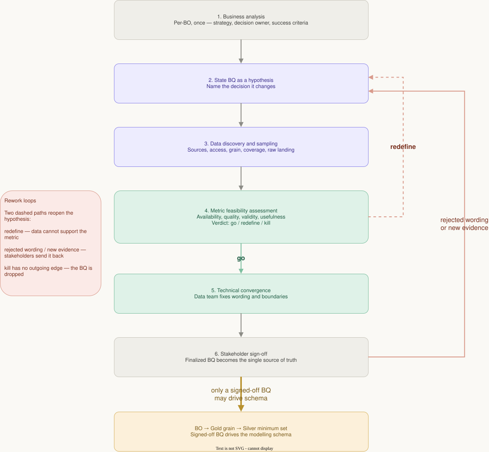

# ADR 0011 — 需求是可证伪的假设：BQ 收敛循环与 BO → Gold → Silver 反推

> **Status**: Accepted · **Date**: 2026-08-20
>
> **相关**: [ADR 0010](0010-gold-fact-grain-and-dimension-layering.md)（本篇反推的产物）·
> [ADR 0008](0008-plow-schedule-is-a-plan-not-a-record.md) ·
> [ADR 0009](0009-plow-zone-as-the-unit-of-analysis.md)（两篇都是本循环跑出来的口径决策）·
> [ADR 0004](0004-silver-cleansing-methodology.md)（同为方法论 ADR，管的是"写代码之前"，本篇管的是"定需求之时"）

---

## 1. 决策

本项目的需求（BQ / Business Question）**按假设管理，不按契约管理**，并且
**schema 的推导方向固定为 BO → Gold → Silver，不允许反向**。

四条具体规定：

1. **一个 BQ 是一个可证伪的假设。** 它必须说清楚"它会改变哪个决策"，
   否则不进入循环——一个不改变任何决策的问题，数据算得再准也没有用处。
2. **可行性判决有三种，`kill` 是其中之一。** 探针实测之后的结论只能是
   `go` / `redefine` / `kill`；"数据不够所以先做个近似"不是合法结论。
3. **只有签字（stakeholder sign-off）后的 BQ 才允许进入建模与看板。**
   签字之前它没有资格决定任何一张表长什么样。
4. **签字之后，schema 由它反推**：Gold 的粒度只依据 BQ 承诺了什么，
   Silver 只提供 Gold 算得出结论所需的**最小充分集**。

循环的六个阶段与再入点由 `bq-converge` skill 定义，本篇不重抄。



---

## 2. 背景：这个循环不是引进的，是被数据逼出来的

三次真实事件确立了它，每一次都是「先定义、后实测、实测推翻定义」：

| 事件 | 假设 | 实测 | 结果 |
|---|---|---|---|
| 供给侧口径 | 排班表的 `shift_end` 是作业完成时间 | `tix9-r5tc` 是**计划**不是执行记录 | 口径改为「排班顺位」，[ADR 0007](0007-clearing-completion-time-source.md) 被 [0008](0008-plow-schedule-is-a-plan-not-a-record.md) 取代 |
| 报告单元 | 按 ward 建模 | 供给侧的作业分区与 ward 不嵌套，25 个分区里 10 个无排班 | 分析单元落作业分区，ward 降为展示标签（[0009](0009-plow-zone-as-the-unit-of-analysis.md)） |
| BO-3 事件定义 | 单日降雪 ≥ 3 cm 切分事件 | 19 次犁雪里 4 次在任何单日阈值下都不落在事件内，真因是**阈下累积** | 事件定义须加滚动累积判据，且 N、面板、回测次数一并变 |

三次里没有一次是"需求写错了要改需求"，全部是**假设被数据证伪**。如果需求当初
按契约冻结、只能走变更流程，这三条会以"已签字，先按原口径实现"的方式落进代码，
然后在报告阶段被人问倒。

**代价也真实**：BO-2 的顺位口径来回收敛了两轮，`metric-feasibility-audit.md`
里至今留着若干条"要改 BO-N 口径"的待办。这个代价是这条决策**买来的**，不是
它的缺陷——它把返工从「代码与数据」阶段挪到了「一句话定义」阶段。

---

## 3. 反推方向：为什么不能反过来

```
Abstract obligation          Analysis unit       Gold grain                        Silver must provide
snowfall events          →   snowfall event  →   dim_snowfall_event                daily weather series
311 complaints           →   zone × event    →   fact_service_request_zone_event   interaction rows + point→zone
the ORDER zones are done →   zone × plow evt →   fact_event_zone_rank              shift_number, UTC + local
ward / nbhd labels       →   label, not grain→   dim_region_crosswalk (weighted)   label text on the same row
```

完整链条与逐表推导在
[design/20260809-gold-silver-schema-derivation.md](../design/20260809-gold-silver-schema-derivation.md) §4.1，
本篇只记方向本身与它的两条推论：

- **报告标签不是分析粒度。** ward 出现在需求的措辞里（"按 ward 汇报"），
  自底向上做一定会把它建成维度并按它聚合；反推之下它落成
  `dim_region_crosswalk` 的一个加权映射，因为**决策发生在作业分区上**。
- **Silver 的字段清单是被 Gold 决定的，不是被上游 API 决定的。** 上游给了
  3,563 个 `type`、15 个渠道，Silver 保留它们是因为 Gold 的两张表要用，
  不是因为上游有。

---

## 4. 被否决的方案

| 方案 | 否决理由 |
|---|---|
| **自底向上**：先看上游有哪些字段 → 按源建 Silver → Gold 从 Silver 拼 | 会把"上游碰巧记录了什么"当成"业务关心什么"。`shift_end` 存在于上游，正是它诱使人把它当作完成时间（ADR 0008） |
| **传统需求工程**：需求一次冻结、不可证伪，改动一律走变更流程 | 本项目的需求全部依赖对**尚未探查过的公开数据**的假设，冻结等于把未验证假设写成契约。上面三条实测每一条都会变成一次变更流程，而不是一次 redefine |
| **不设签字关卡**，探针给出 `go` 就直接建表 | 判决是数据层的，签字是业务层的。BO-6 的三项独立性数据全绿，但"天气影响调度建议"这句表述仍然不成立（天气项 99.4% 方差在事件之间，几乎不影响事件内排序）——这类问题只有人在读措辞时才抓得到 |
| **每个 BQ 一份独立文档树**（`docs/bq/`） | 与文档规范「一个主题恰好一个归属」冲突。假设文本归 `business-objectives.md`，实测数字归 `metric-feasibility-audit.md`，两份都已存在 |
| 把循环写成 skill 就够了，不必立 ADR | skill 是**怎么跑**（可换、可复制到别的项目），ADR 是**为什么这样跑**（0007–0010 的存在方式依赖它）。skill 被改写时，本篇仍是判据 |

---

## 5. 后果

- **ADR 目录里因此有两类决策。** 0001–0006 是栈与架构，0007–0010 是口径与语义
  ——后者全部是本循环的产物，`0007 → 0008` 的 supersede 关系就是一次
  `rejected → 回到阶段 2` 的完整实例。README 的表格已按类别标注。
- **契约冻结与本篇不矛盾。** 2026-08-13 起 `contracts/` 冻结、schema 变更走
  变更流程——那是**签字之后**的工程纪律；本篇管的是签字之前。两者的分界线
  就是阶段 6。
- **探针必须独立于管道。** `scripts/analysis/` 只读公开 API，刻意不依赖 MinIO
  与 Silver，否则"用管道的数据验证管道该建成什么样"是循环论证。这条与
  [ADR 0012](0012-data-quality-audit.md) 的跨层对账共用同一个理由：**对照组
  不能与被测对象同源**。
- **一个 BQ 被 kill 是正常产出，不是失败。** 若发生，在
  `metric-feasibility-audit.md` 记明判据与实测数字；已建的表按变更流程退役，
  不留"以后也许有用"的空表。
- **`event_rule_version` 这类列因此是必需的**（`dim_snowfall_event`）：
  假设可被修订，就必须能分辨一行数据是按哪一版定义算出来的。
