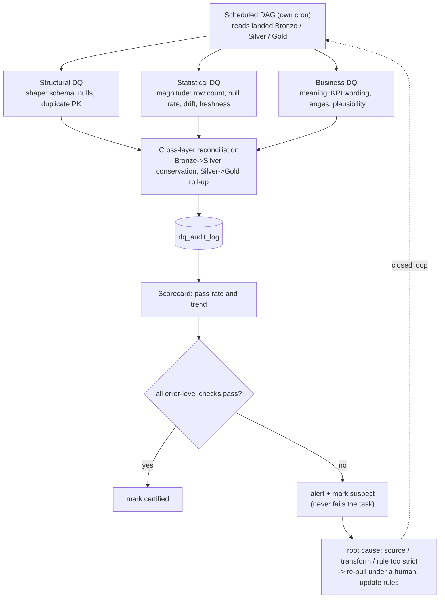

# ADR 0012 — 数据质量审计方案：管道内拦截，管道外复核

> **Status**: Accepted · **Date**: 2026-08-20
>
> **相关**: [复盘：Bronze Socrata 分页无序](../postmortem/bronze-socrata-pagination-incident.md)（本篇的直接起因）·
> [design/20260822-out-of-pipeline-dq-audit.md](../design/20260822-out-of-pipeline-dq-audit.md)（管道外部分的需求细化）·
> [ADR 0010](0010-gold-fact-grain-and-dimension-layering.md)（Gold 三列审计字段）·
> [ADR 0011](0011-bq-hypothesis-loop-and-requirement-backpropagation.md)（对照组不能与被测对象同源，同一条理由）
>
> ⚠️ **本篇定方法论与归属，不定阈值。**（阈值已于 2026-08-22 L3 完成后
> 在 design 篇填入，O1 解封；同篇另定：**管道外一律不用等值行数门禁**。） 阈值需要真实分布，分布要等 L3 三张表
> 落地才齐；细化在 design 篇，不在这里。**本篇不新增也不修改任何 Silver / Gold
> schema**，唯一的新表是审计自己的日志表（§6）。

---

## 1. 决策

数据质量手段分两层，**按「有没有阻断权」划分，不按检查项划分**：

| | **管道内** in-pipeline | **管道外** out-of-pipeline |
|---|---|---|
| 谁跑 | ETL job / Gold 构建器**自身** | 独立 DAG，自己的 cron |
| 何时 | **写盘前**（Gold 是写盘后、发布前） | 数据**已经落盘之后** |
| 失败后果 | **抛异常，数据不落盘**，任务标红 | **只报告与打标，不阻断，任务不红** |
| 能看见 | 本次窗口 / 本次构建 | 跨批次、跨层、跨时间 |
| 回答的问题 | 「这一批能不能写」 | 「已经写下去的这一堆，今天还成立吗」 |

四条不可协商的规定：

1. **管道内的断言一条都不外迁。** 它们的价值恰恰在于「不落盘」，搬到管道外
   就退化成事后通知。管道外是**增加一层**，不是重构。
2. **管道外的发现不让任务变红。** 变红的只有「检查本身跑不起来」。Bronze 不可
   变更，发现之后的重拉是人工经 CLI 的事；一个因发现而长红的 DAG 会被静音，
   然后连"检查跑没跑"都没人看了。
3. **两层都必须存在，不能互相替代。** 分页无序那次故障两边都该抓、两边都没抓：
   管道内的 `assert_unique` 只覆盖被跑到的窗口，管道外当时根本不存在。
4. **对账的对照组不能与被测对象同源。** 拿 Bronze 校验 Bronze 只能发现自相
   矛盾，发现不了整体偏移；上游 `count(*)` 与独立探针才是有效对照。

---

## 2. 管道内：现状即方案，逐条列明归属

平台**已有**的管道内手段如下。本篇的作用是把它们认领为一个体系，而不是新建：

| 层 | 检查 | 实现 | 失败后果 |
|---|---|---|---|
| Bronze 采集 | 快照 `min_records` 下限 | `ingestion/snapshot/` | 拒绝落盘，**不覆盖前一天** |
| Bronze 采集 | manifest 的 `sha256` / 行数记录 | loader | 不拦截，是后续对账的**证据** |
| Silver | schema 强制对齐 | `enforce_schema` | 抛异常 |
| Silver | 主键唯一性 | `assert_unique`（**断言，不去重**） | 抛异常 |
| Silver | 值域 / 时序合法性 | `split_by_validity`，坏行落 `silver/_rejects/` | 坏行隔离，好行照写 |
| Silver | 空间命中率 | `zone_assignment` 三值 `geo_match_status` | 低于基线抛异常 |
| Silver | 行数下限 | job 内 `MIN_EXPECTED_ROWS_*` | 抛异常 |
| Gold | **精确行数门禁** | `scripts/gold/gates.py`（R4） | 构建失败，发 Discord |
| Gold | anti-join / 扇出守卫 | 同上 `extra_gates` | 同上 |
| 结构断言四件套 | `unique` / `not_null` / `relationships` / `accepted_values` | L3-c | 属管道内，留在 L3 |

三条从实测里长出来的规矩，写在这里免得被当成可省的严格：

- **`INSERT` 是追加，所以 Gold 的精确行数门禁是承重件不是复核。** 整表重建的
  第二步「清 storage prefix」失败时，唯一会喊的就是它（R4）。
- **等值门禁与下界门禁要分清。** 读**实时上游**的数字会漂（F1 的非零格
  916 → 908，机制是 Open-Meteo 回修历史存档导致事件重切），这类改成
  `>=` 下界；能抓构建故障的数字保持等值。目前只有一条是下界，由单测钉死。
- **三值不塌成 NULL。** 「没坐标」与「坐标落在所有多边形外」责任人不同，
  合并就是让告警分母算错——上游 79% 无坐标，全表口径会永远报警然后被静音。

**本篇不改动上表任何一条。**

---

## 3. 管道外：三类检查 + 一项独有能力

| 类别 | 查什么 | 本项目已有的实现 |
|---|---|---|
| **结构性** | 形状对不对：schema、必填空值、主键重复 | Bronze 校验 **B**（分片内 PK 唯一），`scripts/profiling/bronze_integrity_audit.py` |
| **统计性** | 量级对不对：行数、空值率、分布漂移、**freshness** | 尚无调度；基线来自 L1/L2 launch 与 L3-c |
| **业务性** | 意思对不对：口径、值域、合理性 | 探针 `scripts/analysis/`（口径复现），未进调度 |
| **跨层对账**（本层独有） | Bronze→Silver 行数守恒；Silver→Gold roll-up 一致 | 校验 **C**（Bronze vs 上游 `count(*)`）；Silver↔Gold 已做过一次性核对 |

🔴 **B 与 C 不是二选一。** 一次分页边界滑动**同时**重复一行、丢掉一行，两者
在行数上相互抵消：C 单独会判该日干净，B 单独永远看不见丢行。这是本篇存在的
原始理由，不是理论推演。

**四条已定的执行规则**（来自复盘「落地时必须遵守的四条」，本篇确认为长期约束）：
PK 取自 `config/sources/*.yaml` 的 `primary_key`，**没有 PK 的数据集跳过 B 而
不是猜**；`snapshot` 与 `static` 永不作为目标；C **豁免最近 `late_arrival_days`
天**——311 最新一两天天生偏薄是稳态不是缺口（O17 的结论）；日常跑滚动窗口，
全量扫描留作手动 `full_sweep`。

---

## 4. freshness 的特殊地位

「数据停更」是唯一一类**管道内原理上抓不到**的问题：管道没跑，就没有任何断言
被执行。所以它只能由管道外或调度层发现，本项目分两处：

- **调度层**：`_alerts.alert_on_failure`（DAG 失败 → Discord）+ `ping_watchdog`
  （死人开关，管"DAG 根本没被调度"）。BO-7 快照跑在 Airflow 之外，自带这两样。
- **管道外**：最新分区日期与预期的差值，作为统计性检查的一项。

历史教训：`dag_backfill_silver_weather_archive` 曾连续失败 12 天无人知晓——
那时告警能力**根本不存在**。以及 O17 的三次 failed run 打断了 7 天回溯的自愈，
真正的告警要等重试耗尽 16 分钟才发出。

---

## 5. 通用范式里**不适用**本项目的部分

参考资料里的标准做法有几条在这里是错的，明确否决，免得日后被"业界都这么做"
推回来：

| 通用做法 | 本项目为何不适用 |
|---|---|
| **WAP（Write-Audit-Publish）**：先写临时区，审计通过再切给下游 | Gold 的整表重建在 Hive 连接器上**不是原子的**（R4：`CREATE OR REPLACE` / `TRUNCATE` / `DELETE` 全部 `NOT_SUPPORTED`），`RENAME` 也换不回原子性——它只会把表的物理位置搬走。几秒钟的空窗已被显式接受，唯一读者是 Superset |
| **Bronze 层设「闸门」拦住脏数据入库** | Bronze 的定义就是**不可变的原始副本**。上游给什么就落什么，拦下来等于让 Bronze 不再等于上游，之后所有对账都失去基准。Bronze 只做**记录**（manifest）与**事后核对**，不做拦截 |
| **dbt tests / Great Expectations / Soda Core / Monte Carlo** | 本项目没有 dbt——Gold 由 `scripts/gold/build_gold.py` + Trino SQL 构建。为四类检查引入四个框架，运维成本高于自己写 SQL 断言；且计算节点只剩 7 GB 可用内存。**用现有的 Python + Trino 实现，不引框架** |
| **坏行 quarantine 隔离表**（作为管道外能力） | 已经是**管道内**能力：`silver/_rejects/window={start}_{end}/`。管道外无权改动已落盘数据，只能打标 |
| **on-call 值班 / 事故工单** | 单人项目，无 SLA。"告警"= Discord，"工单"= 台账里一条开放项 |
| **certified / suspect 打标驱动下游可见性** | 方向对，但下游只有一个 Superset 看板。落法是看板上的一处提示，不是权限或视图切换 |

---

## 6. 交付物与实施顺序

- **`dq_audit_log`**（本轮唯一新表；第三批再加一张 `gold_certification`）。
  两张都落**新 schema `uoip_meta`**，不进 `uoip_gold` —— `build_gold.TABLES` /
  `dq_baseline.py` / `dq_assertions.py` 三处都在遍历「Gold 的每一张表」，
  混进去就要在三处各加一次排除，漏一处就是审计表被当业务表 purge 掉。
  它也是唯一一张**追加不重建**的表：重建等于每天把趋势抹掉。字段与理由：每条检查一行——运行 ID、层、表、规则名、
  检查行数、失败行数、严重级别（`warn` / `error`）、时间戳。它是趋势与计分卡
  的唯一来源，**没有它就只有"今天过没过"，没有"是不是在变坏"**。
- **实施分批，不一次做完**：
  1. ✅ **第一批（已完成 2026-08-22，`a5304cb`）**：Bronze 校验 B/C 进
     `dag_audit_bronze` 的 `audit_integrity` 任务（L2 的 **O8**）。
  2. **第二批**：`dq_audit_log` + 统计性检查（行数 / 空值率 / freshness），
     阈值取 L3-c 的 DQ 基线。
  3. **第三批**：跨层对账（Silver→Gold roll-up）+ 计分卡 + certified/suspect 打标。
- **阈值来源固定为 L3-c 的一次性基线**，不是拍脑袋。基线本身**留在 L3**——
  它是上线门禁的一部分，跟着那次构建走；本篇消费它。

---

## 7. 后果

- **多一个 DAG、多一张表、多一份定时开销**，换来的是慢性问题可见：跨批次漂移、
  静默停更、跨表不一致——这三类在单次管道运行内**原理上看不见**。
- **管道外无法阻止坏数据进 Gold**，这是它的定义不是它的缺陷。要拦，就把那条
  检查写进管道内（并接受它只覆盖本次窗口）。两层的取舍是「覆盖面 vs 阻断权」，
  任何一条检查落在哪一层都按这条判据决定。
- **阈值会随上线数据微调，方法论不动。** 若某条阈值反复误报，正确处置是回到
  §3 的根因分析问「是规则过严还是数据真的变了」，而不是删掉这条检查。
- **本篇不改变 [ADR 0011](0011-bq-hypothesis-loop-and-requirement-backpropagation.md)
  的签字关卡**：审计判定的是「数据是否符合已签字的口径」，不判定口径本身对不对。
  口径有问题走 BQ 循环，不走审计。
