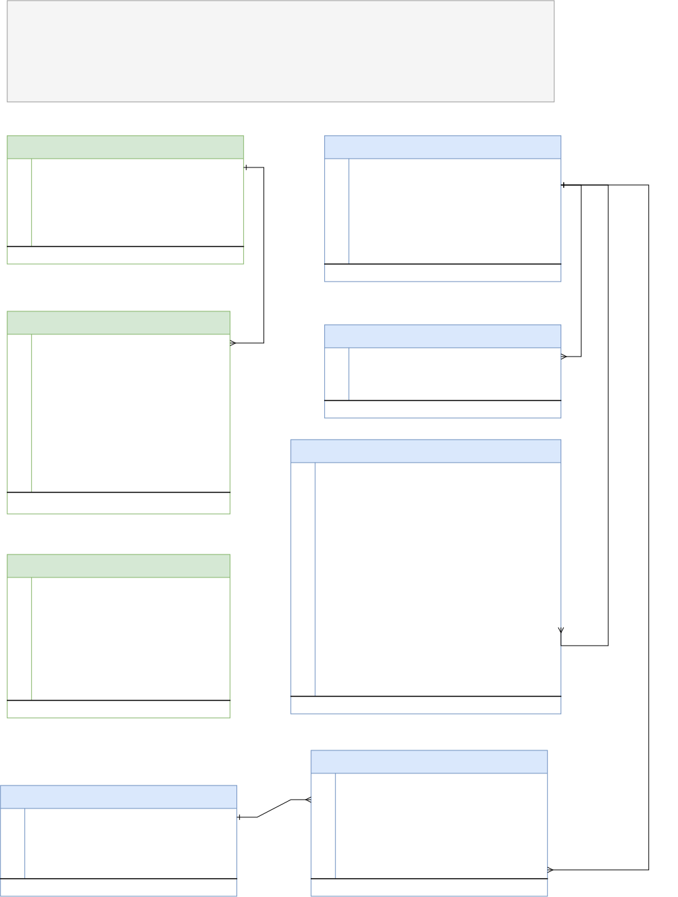
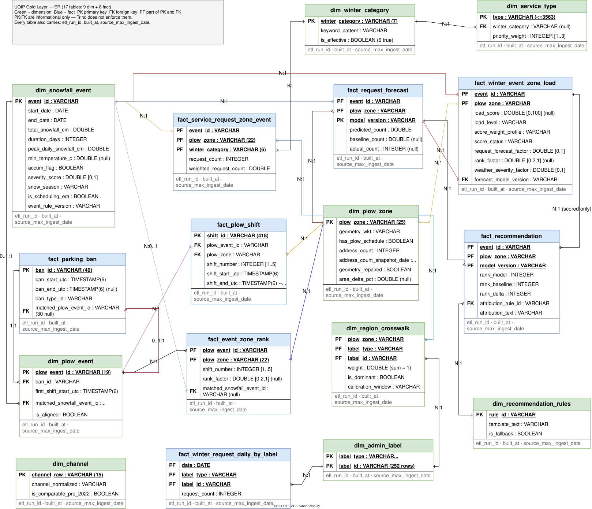

# 平台架构

> 本篇是**设计意图**，写给要改架构的人。只想知道"系统长什么样、怎么跑"的读者，
> 看对外文档 [Architecture](../guide/architecture.md) 即可。
> 具体决策的取舍过程见 [adr/](adr/README.md)。

---

## 1. 组件与数据流

| # | 组件 | 职责 | 技术 |
|---|---|---|---|
| 1 | 数据源 | 开放数据 API + 气象 API + 静态边界文件 | Socrata SODA / Open-Meteo / GeoJSON |
| 2 | 摄取层 | 定时触发、分页、增量拉取、错误重试，原始数据落 Bronze | Python + Airflow |
| 3 | Bronze | 不可变原始快照 | 对象存储 + NDJSON |
| 4 | 处理层 | Schema 强制、类型转换、去重、脏数据处理、标准化 | PySpark on Spark Standalone |
| 5 | Silver | 清洗后的列式数据 | 对象存储 + Parquet |
| 6 | Gold | 星型模型、业务逻辑、空间分析 | Trino + Hive Metastore（Parquet，后续可迁 Iceberg） |
| 7 | 智能引擎 | 负荷分计算、驱动因素识别 | SQL 规则引擎 |
| 8 | 推荐引擎 | 资源配置建议 | SQL 规则表 |
| 9 | 报表 | 负荷地图、排名、建议展示 | Superset |
| 10 | 编排与监控 | 依赖管理、调度、告警 | Airflow |

全栈自建，无云托管组件。技术选型的取舍过程见
[ADR 0006](adr/0006-storage-compute-query-stack.md)。

**分层边界的硬规则**：Airflow 不碰数据，Spark 不做调度，SQL 不做摄取。
DAG 文件里出现业务逻辑视为架构违规。

### 1.1 部署拓扑

存储与计算**分离部署在两个节点**上：

| 节点 | 承载 | 性质 |
|---|---|---|
| 存储节点 | MinIO（专用，100 GB / 可用 90 GB）；BO-7 快照采集定时任务 | 项目数据的**唯一真相源**，不可重建 |
| 计算节点 | Airflow · Spark · Trino · Hive Metastore · Superset（4 core / 24 GB ARM） | **无状态，可整体重建** |

分离的依据是可用性边界不同，而非性能。计算节点重建不损失数据；存储节点承载的是
不可重新获取的历史资产。由此引出一条一般原则：

> **不可重放的采集任务，其可用性不应依赖可重建的组件。**

这是 BO-7 的每日快照采集**不作为 Airflow DAG**、而是作为存储节点上独立定时任务
运行的原因——它是全项目唯一"漏一天则永久丢一天"的任务。代价是不受 Airflow 的
重试与告警覆盖，需自带失败通知。

存储节点**无备份、无副本**，这是显式接受的风险而非遗漏：本项目为实验性质，
交付物是论文与报告，除 BO-7 快照历史外的数据均可从上游重新回填。理由与重新
评估的条件见 [ADR 0006](adr/0006-storage-compute-query-stack.md) §2.1.1。

---

## 2. 分层设计

### 2.1 Bronze —— 不可变原始层

- **目的**：单一真相来源。任何下游算错了都能从这里重放。
- **格式**：NDJSON，gzip 压缩（`.ndjson.gz`）。换行分隔不是风格选择——
  `spark.read.json()` 只吃这个格式。压缩也不是优化项：实测压缩比 5.6×–10×，
  见 [data-volume-baseline.md](data-volume-baseline.md)。
  ⚠️ 必须靠**文件扩展名**声明压缩，不能只设 `Content-Encoding`，原因见
  [ADR 0006](adr/0006-storage-compute-query-stack.md) §4.1。
- **manifest 不压缩**：每份仅数百字节，保持可直接查看，且使审计的存在性检查
  逻辑与压缩策略解耦。
- **分区**：按源的 `partition_strategy`（daily / monthly / static / snapshot）
  决定路径布局，每个数据文件配一份 manifest。详见
  [Ingestion & Bronze](../guide/ingestion-bronze.md)。
  `snapshot` 用于**无时间字段的覆盖式数据集**——按采集日而非记录日期分区，
  把只有当前状态的上游快照积累成纵向序列（BO-7）。
- **红线**：永不覆盖已写入的 Bronze 文件。

### 2.2 Silver —— 清洗层

- **格式**：Parquet，按日期分区。
- **处理内容**：Schema 强制 → 类型转换 → 去重 → 缺失值策略 → 字段标准化 →
  时间戳统一 UTC。
- **去重的难点**：7 天回溯窗口必然重复拉取同一天的数据，每个源必须定义
  **去重键 + 新鲜度规则**，否则重复会累积。
- **被拒绝的行**：写入 `silver/_rejects/{dataset}/` 而不是静默丢弃。
- **幂等**：动态分区覆盖，只重写窗口内涉及的分区。
- **表清单**：8 张。列级权威是 `contracts/silver-contracts/*.yaml` 与 `sql/ddl/`。

#### ER 图

> 维护方式同 Gold（见 §2.3）：svg 自带可编辑源码，直接拖进 draw.io 改。

Silver 的连线比 Gold 少，这是分层意图而不是漏画——**业务语义不在 Silver 解析**：
`type` / `channel_raw` / `ward_raw` / `neighbourhood_raw` 都以原值落盘，
归一化与分类在 Gold 的 `dim_service_type` / `dim_channel` / `dim_admin_label` 里做
（城市无关护栏 §1）。读图注意三点：

- **`silver_plow_zone_boundary` 是唯一的空间锚点。** `silver_service_request.plow_zone`
  与 `silver_snow_clearing_address.plow_zone` 都是对它做点在多边形判定得到的，
  不是文本查表——同一族 join，不是两套实现。
- **`silver_service_request` 的主键是 `(case_id, interaction_id)`。**
  `case_id` 单独不唯一（1.87% 重复），行粒度是 interaction 不是 case。
- **`silver_snowfall_event` 不是摄取来的**，它是 `silver_weather_archive` 按 BO-3
  事件切分规则派生出来的（图上用虚线表示），`event_rule_version` 记录用的是哪版规则。

### 2.3 Gold —— 业务层

- **格式**：Hive 分区 Parquet，经 Hive Metastore 注册为 Trino 表，星型模型。
  Iceberg 分阶段引入——先跑通 Parquet，待 311 的晚到更新真正需要 `MERGE INTO`
  时再切 connector（[ADR 0006](adr/0006-storage-compute-query-stack.md) §5）。
- **表清单**：17 张，9 维 + 8 事实。粒度与分层的取舍见
  [ADR 0010](adr/0010-gold-fact-grain-and-dimension-layering.md)，
  每张表为哪条 BO 验收标准存在见
  [design/20260812-gold-bus-matrix.md](design/20260812-gold-bus-matrix.md)。
  列级权威是 `contracts/gold-contracts/*.yaml` 与 `sql/ddl/`，不是本图。
- **分区/聚簇**：事实表按日期分区，按作业分区（`plow_zone`）聚簇。
- **空间归属（关键能力）**：原始数据的行政区文本字段错误率高（大小写不一、
  缺失、填错），**必须**用坐标 + 边界多边形做空间 JOIN 作为权威归属：
  `ST_Contains(geometry, ST_Point(lon, lat))`（Trino geospatial 函数）。
  文本字段只作为空间命中失败时的降级方案，仍不可解析则标 NULL 并排除出评分。
- **几何体存储**：Silver 落 WKT 字符串，Gold 用 `ST_GeomFromText` 转几何类型。
  Silver 落 WKT 的原因见
  [ADR 0005](adr/0005-execution-architecture.md) §2.1——当时是被迫的
  妥协，在 Trino 下反而是最直接的输入格式。

#### ER 图

> **`.drawio.svg` 既是图也是源码**：导出时勾了「Include a copy of my diagram」，
> 完整的 mxfile 存在 svg 根节点的 `content` 属性里。改图就把这个 svg 直接拖进
> draw.io（*File → Open From → Device*），改完**覆盖导出同一个文件名**，
> 保持这个勾选。仓库里因此不存 `.drawio.xml`——一份文件两个用途，
> 不会出现 xml 与 svg 各说各话。
>
> 契约变了图要跟着变——这是常青文档，原地重画不留版本痕迹。

读图时最容易记错的四件事：

- **`plow_event` 与 `event` 是两个粒度。** `dim_plow_event` 是 19 次全城作业，
  `dim_snowfall_event` 是 99 个降雪事件，靠 `matched_snowfall_event_id` 连接：
  19 个里 2 个为 NULL，非 NULL 时唯一——这个唯一性就是 F6 join 进来时的
  fan-out 护栏。
- **行政区永不进事实表主键**（ADR 0010 D2）。`region_type` / `ward` /
  `neighbourhood` 在 F1、F5、F6、F7 上是 `forbidden_columns`。唯一按行政标签建键的
  事实表是 `fact_winter_request_daily_by_label`，它是描述性汇总，不在评分链上。
  分区→标签的换算走 `dim_region_crosswalk.weight`。
- **面板大小不一致是设计如此。** `fact_service_request_zone_event` 是
  22 × 99 × 6 = 13,068 行满面板（M1 的训练集，含排班期之前的事件），
  而评分链只读其中 1,298 格的排班期子集。
- **`model_version` 是主键的一部分**（F5 / F7），所以重训是新增一版回测，
  不覆盖上一版（ADR 0010 D5）。
- ⚠️ **空间命中率告警的分母必须是有地理信息的子集。** Winnipeg 311 全表仅 20.9%
  带坐标，这是上游固有特性而非管道缺陷，按全表计算会持续误报。见
  [business-objectives.md](requirements/business-objectives.md) §2.1。

---

## 3. 关键设计考虑

### 数据质量
Schema 在 Spark 阶段强制执行，脏数据不得进入 Silver。关键字段做范围校验
（坐标是否落在城市范围内）。Bronze→Silver、Silver→Gold 的行数与关键指标做监控，
异常告警。

### 错误处理与幂等性
所有任务可重试；所有 ETL 必须幂等——同一个 `execution_date` 重跑产出完全相同，
不产生重复。Gold 层用 `MERGE` 或 `INSERT OVERWRITE PARTITION`。

### 可扩展性
分区裁剪是查询性能的关键。查询引擎在本项目的数据量级（约 10 GB/年）上是过剩的，
选型考虑的是能力匹配与可迁移性，不是吞吐——取舍见
[ADR 0006](adr/0006-storage-compute-query-stack.md) §3。

### 安全性
密钥不落任何 git-tracked 文件，也不进入任何会被序列化或展示的位置——
**特别是不经 `spark-submit --conf` 传递**，那会出现在 Spark UI 环境页、进程列表
与 Airflow 任务日志中。走 worker 上的 `spark-defaults.conf`（权限 600）或环境变量。
原则的历史来源见 [ADR 0001](adr/0001-terraform-and-secrets.md)（该篇已被 0006
取代，但密钥管理原则仍有效）。

### 成本控制
全自建栈，无按量计费组件，成本控制的对象从"账单"变成"固定资源上限"：
- 存储：年增量约 10 GB（[实测基线](data-volume-baseline.md)），线性可外推；
  存储节点 90 GB 可用，约 9 年余量，不构成约束。
- 内存：计算节点是唯一硬约束，所有服务常驻后余量有限，新增组件前先算内存预算。
- 查询：避免全表扫描，用分区裁剪。

### CI/CD
DAG、PySpark 脚本、SQL 全部版本控制，PR 门禁跑 `make lint` + `make test-unit`。
（当前尚无 `.github/`，是已知技术债。）

---

## 4. 相关文档

- [ADR 索引](adr/README.md)
- [交付路线](roadmap.md)
- 各层真实进度：仓库根目录 `CLAUDE.md` 的 Implementation status 一节
