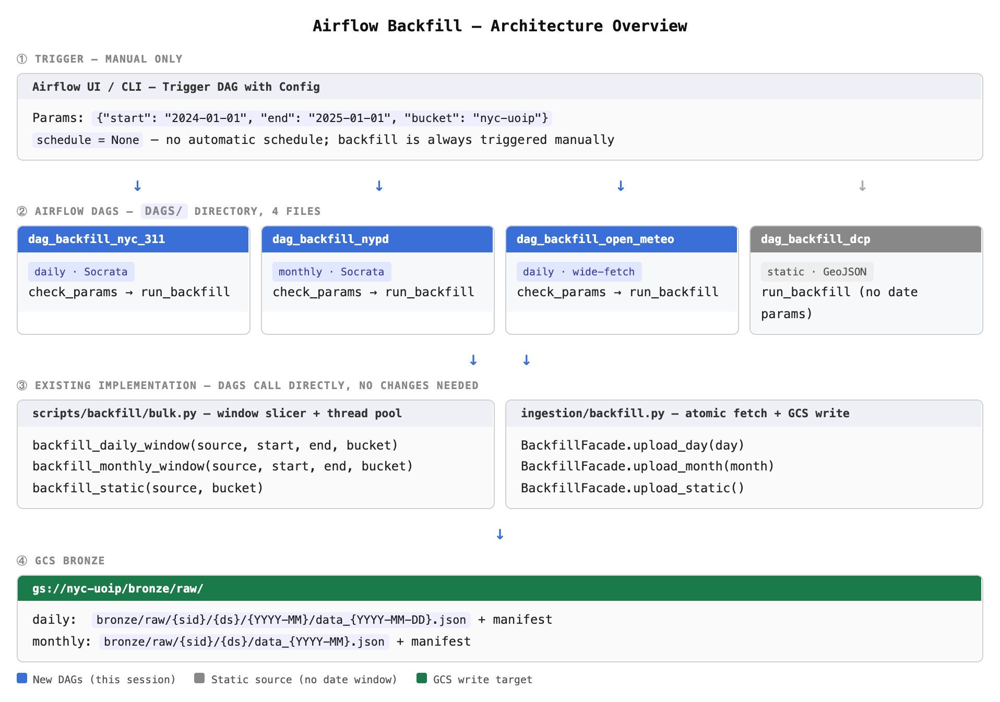

# Ingestion & the Bronze Layer

Bronze is the immutable record of what each upstream API returned. Nothing in the
platform is allowed to overwrite or edit a Bronze file after it is written.



## File format

All Bronze data files are **NDJSON** (`.ndjson`) — one JSON record per line.
This is not a style preference: BigQuery `LOAD DATA` and `spark.read.json()` both
require newline-delimited records and reject JSON arrays.

Every data file has a paired manifest describing that partition (row count,
fetch time, source parameters). The audit DAG uses manifests to detect gaps.

## Partition layout

Each source declares `partition_strategy` in its YAML, which decides the path layout:

| Strategy | Used by | Path |
|---|---|---|
| `daily` | `SRC-NYC-311`, `SRC-Open-Meteo` | `bronze/raw/{sid}/{ds}/{YYYY-MM}/data_{YYYY-MM-DD}.ndjson` + `manifest_{YYYY-MM-DD}.json` |
| `monthly` | `SRC-NYPD` | `bronze/raw/{sid}/{ds}/data_{YYYY-MM}.ndjson` + `manifest_{YYYY-MM}.json` |
| `static` | `SRC-DCP` | `bronze/raw/{sid}/{ds}/data_static.ndjson` + `manifest_static.json` |

Under `daily`, records are split into per-day files by the date portion of the
dataset's `timestamp_field`. Records with a missing or unparseable timestamp are
dropped rather than filed under the wrong day.

## Code layout

```
scripts/backfill/backfill_<source>.py   CLI entry points — argparse only
        ↓
scripts/backfill/bulk.py                window slicing + thread pool
        ↓
ingestion/backfill/facade.py            one atomic fetch+write per document
        ↓
object storage (Bronze)
```

Business logic lives only in the facade and bulk layers. Per-source scripts and
DAG files are pure dispatch — no API calls, no date arithmetic inline.

## Scheduled DAGs

| DAG | Schedule | What it does |
|---|---|---|
| `dag_ingest_nyc_311` | `0 6 * * *`, catchup | Yesterday + 7-day lookback |
| `dag_ingest_open_meteo` | `0 6 * * *`, catchup | Yesterday's actuals + 7-day forecast |
| `dag_ingest_nypd` | `0 6 1 * *`, catchup | Previous month |
| `dag_ingest_dcp` | manual | Static source, refreshed on demand |
| `dag_audit_bronze` | `0 8 * * *` | Self-heal — see below |

Manual backfill DAGs (`dag_backfill_*`) take `start` / `end` / `bucket` params.
See [Backfill](backfill.md).

## Self-healing

`dag_audit_bronze` runs daily at 08:00. It scans manifests over a rolling window
(14 days for daily sources, 3 months for monthly), and for any gap it finds it
calls the same bulk functions the backfill path uses. If a gap cannot be filled
the task fails loudly rather than silently leaving a hole. `SRC-DCP` is excluded.

This means a transient upstream outage generally repairs itself:

```
ingest DAG fails
  → retries=3 (covers network flakiness)
  → catchup=True re-runs the missed interval on the next scheduler pass
  → dag_audit_bronze finds any remaining gap and refills it
  → still failing? task turns red and alerts
```

## Rules

- Never overwrite a Bronze file.
- Use `execution_date`, never `datetime.now()`, for window logic.
- Every DAG sets `retries=3`, `retry_delay=5min`, and a failure callback.
- Socrata-backed DAGs implement a 7-day lookback for late-arriving facts.
