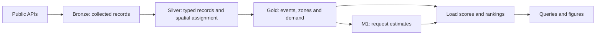

# Overview

The **Urban Operations Intelligence Platform (UOIP)** is an open-source data
engineering project that studies winter operations in Winnipeg, Canada. It brings
together service requests, residential plow schedules, weather and geographic
boundaries to explore a practical question:

**How do service demand and scheduled plowing order vary across the city during a
snowfall, and what can the available data tell us about those differences?**

The result is a working pipeline, a historical analysis, and a model-backed scoring
and ranking experiment. You can inspect the queries, trace a score to its inputs,
and try the presentation renderer on your computer without running a data cluster.

- **See what we found:** [Results](results.md).
- **Try it locally:** [Getting Started](getting-started.md).
- **Explore the engineering:** [Architecture](architecture.md).

## The problem

Imagine reviewing a winter's residential snow-clearing operations. You have the
requests residents submitted, the shifts in which each plow zone was scheduled,
and the snowfall recorded during those operations. You want to understand whether
some zones regularly appear later in the schedule, how demand varies, and what
happens when those signals inform a proposed ranking.

Each source answers only part of the question. Requests measure reported demand.
Schedules describe planned work. Weather describes the event that both respond
to. Their dates and geographic units do not align automatically: a ward, a
neighbourhood and a plow zone are different ways of dividing the same city.

UOIP builds that alignment and keeps the source limitations visible in the result.
It provides an analytical view of past operations rather than a street-status
lookup or a live dispatch interface.

## How it works

The analysis follows **one snowfall event in one plow zone**. In database terms,
this is the *grain*: what one row represents.

Bronze preserves the collected payload and a manifest describing it. Silver makes
types, time and geography consistent. Gold organizes the data around the analysis:
snow events, zones, requests and scheduled shifts. A statistical model estimates
request counts; SQL combines the estimates with scheduling order and weather,
then produces rankings and rule-based explanations.

For example, a zone's high score can be traced to its demand factor, scheduled
shift and event severity. Those are contributions to a formula, not proof that
one of them caused poor service. [Scoring and Recommendations](scoring-and-recommendations.md)
walks through that distinction.

## What the data changed

The initial question was broader than the sources could support. Investigating
those limits shaped the implementation.

**A schedule could not measure completion.** The shift table contains 19
residential operations, each covering the same 22 zones in planned shifts. It
does not record when an individual zone was actually cleared. The analysis
therefore uses scheduled order and does not interpret an absent operation as
“no service.”

**Administrative labels could not identify the work zone.** Requests carry ward
and neighbourhood labels, but those boundaries overlap plow zones. Silver assigns
located requests to work zones; Gold carries administrative areas through weighted
relationships. A ward label is useful context, not permission to call a zone score
a ward score.

**A successful download could still contain wrong records.** Unordered API
pagination repeated some rows and lost others. The errors sometimes cancelled in
the total count. That failure led to complementary uniqueness and reconciliation
checks, described in [Data Quality](data-quality.md).

These are useful lessons for anyone learning data engineering: field names do not
establish meaning, a join needs a defensible grain, and successful execution does
not establish data correctness.

## What this version delivers

This guide describes the **H1 historical-analysis baseline**: schema v1.0 recorded
on August 22, 2026, results measured August 30–31, and the presentation renderer
recorded September 3. H1 is the project's first delivery milestone; it does not
mean every planned service or deployment feature is complete.

| Area | Available in this baseline |
|---|---|
| Collection | Winnipeg source ingestion, historical backfill and a daily clearing-status snapshot collector deployed since August 2 |
| Transformation | 8 Silver table definitions and 17 populated Gold tables in the recorded build |
| Analysis | Snow-event segmentation, spatial alignment, scheduling-order analysis and request aggregation |
| Modeling | M1 request-count estimates and a time-ordered holdout evaluation using historical weather features |
| Scoring | An explicit serving model version, load scores, ranking comparisons and rule-based attribution |
| Verification | Build assertions, independent data-quality audits and Gold certification records |
| Presentation | 19 validated figure queries; HTML rendering for three scheduling figures, with sample inputs included |

The schema baseline is recorded in the [changelog](../../CHANGELOG.md).
[Results](results.md#data-and-version-context) binds the reported findings to their
measurement context. These are dated observations, not a live status dashboard;
new API pulls and rebuilds may produce different counts.

## Where the conclusions stop

H1 evaluates historical events using weather archive values. It does **not**
demonstrate an operational forecast issued before a storm. The held-out season
contains only seven events, so the error comparison does not establish a reliable
predictive advantage.

Scheduled order is not completion time or a fairness verdict. Reporting patterns
affect 311 demand, and current address counts are an imperfect denominator for
older events. Scores use two different weight profiles when scheduling evidence
is missing; their levels cannot be compared as though they share one scale.

The daily snapshot archive preserves observations going forward. It cannot
reconstruct missing historical days or supply exact completion timestamps between
observations. A request-duration model (M2) and a complete operations dashboard
are outside this baseline. You can deploy the standard infrastructure components
yourself; [Getting Started](getting-started.md#run-the-pipeline-on-your-own-infrastructure)
explains which ones the repository starts and which ones to prepare separately.

## Choose your next step

| You want to… | Continue with |
|---|---|
| Understand the findings and their limits | [Results](results.md) |
| Get a first hands-on result | [Getting Started](getting-started.md) |
| Learn why the components fit together | [Architecture](architecture.md) |
| Understand the raw material | [Data Sources](data-sources.md) |
| Read a score or ranking correctly | [Scoring and Recommendations](scoring-and-recommendations.md) |
| Verify or operate the pipeline | [Data Quality](data-quality.md), then [Operations](operations.md) |
